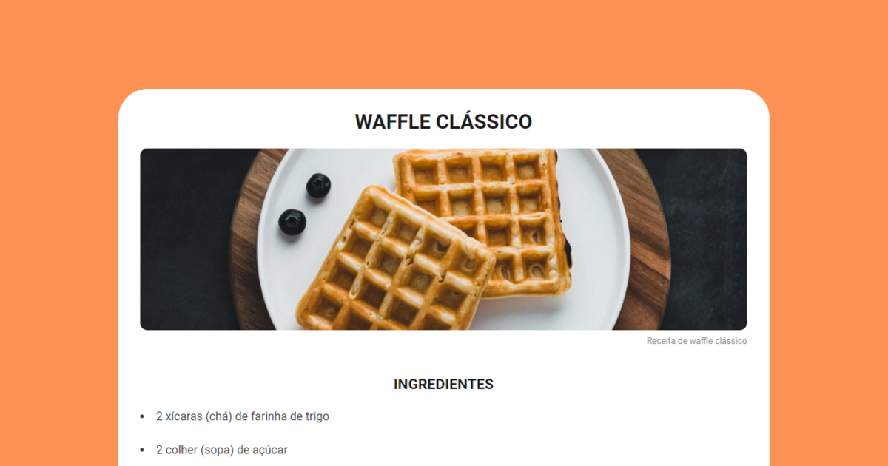

<h1 align="center"> Desafio Piloto: Página de Receita </h1>

  <a href="#-tecnologias">Tecnologias</a>&nbsp;&nbsp;&nbsp;|&nbsp;&nbsp;&nbsp;
  <a href="#-projeto">Projeto</a>&nbsp;&nbsp;&nbsp;|&nbsp;&nbsp;&nbsp;
  <a href="#-desafio">Desafio</a>&nbsp;&nbsp;&nbsp;|&nbsp;&nbsp;&nbsp;

 

  

## 🚀 Tecnologias

Esse projeto foi desenvolvido com as seguintes tecnologias:

- HTML e CSS

## 💻 Projeto

Desafio Piloto: Página de Receita, é um pequeno projeto da Rocketseat, para consolidar os conhecimentos aprendidos em aula

- [Acesse o projeto finalizado, online](https://pietroas.github.io/Desafio-pg-de-receita/)

## 🔖 Desafio

Você pode visualizar as Instruções para esse desafio através [DESSE LINK](https://efficient-sloth-d85.notion.site/Desafio-Piloto-P-gina-de-Receita-15acc6a34f744484a2e64a1f115bfbae).

---

Feito com ♥ by Rocketseat :wave: [Participe da nossa comunidade!](https://discord.gg/rocketseat)
